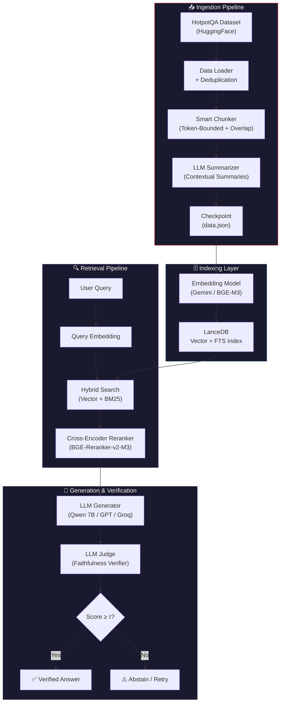
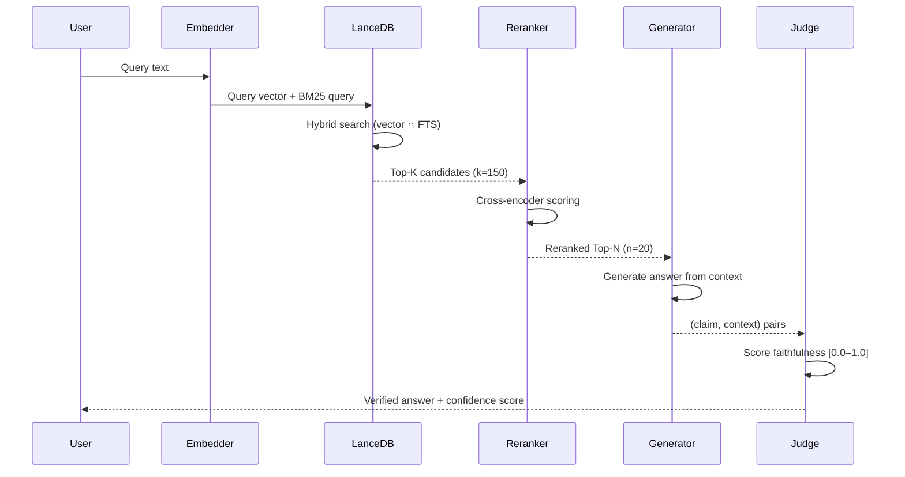
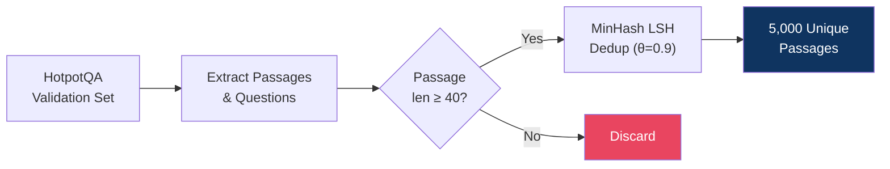
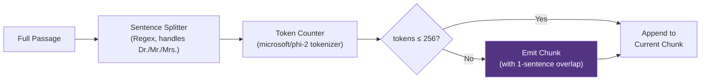
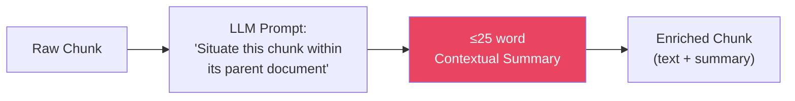
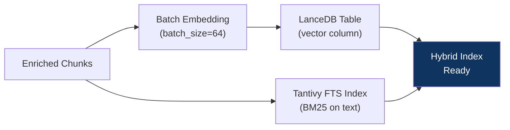
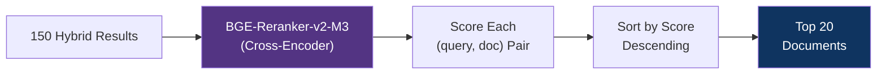
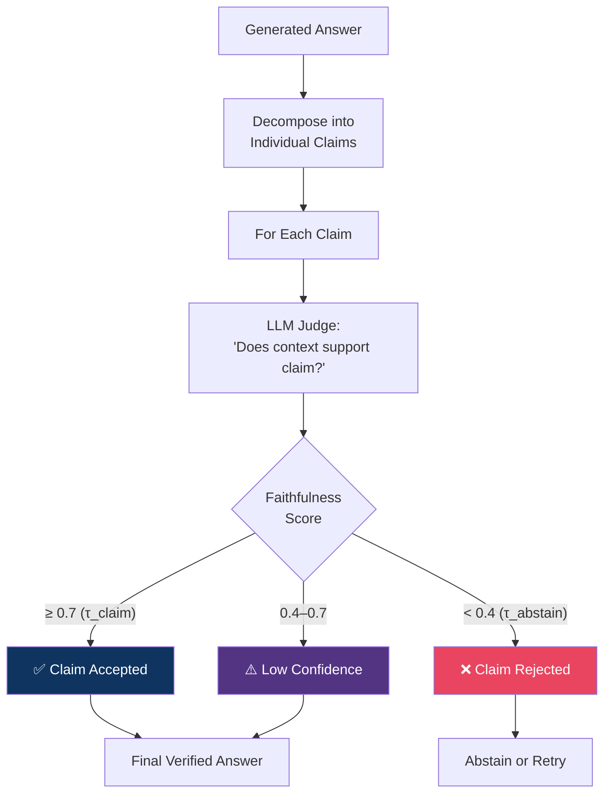

<div align="center">

# 🧠 Zero Hallucination RAG

### A Production-Grade Retrieval-Augmented Generation Pipeline  
### Engineered to Minimize Hallucinations Through Multi-Stage Verification

[](https://python.org)
[](https://lancedb.com)
[](https://huggingface.co)
[](https://groq.com)
[](https://docs.vllm.ai)

</div>

---

## 📌 Table of Contents

- [Problem Statement](#-problem-statement)
- [Solution Overview](#-solution-overview)
- [Architecture](#-architecture)
- [Pipeline Deep Dive](#-pipeline-deep-dive)
- [Project Structure](#-project-structure)
- [Key Components](#-key-components)
- [Design Trade-offs & Decisions](#-design-trade-offs--decisions)
- [Tech Stack](#-tech-stack)
- [Getting Started](#-getting-started)
- [Configuration](#%EF%B8%8F-configuration)
- [Future Roadmap](#-future-roadmap)

---

## 🔴 Problem Statement

Standard RAG pipelines suffer from a critical reliability gap:

| Failure Mode | Description | Impact |
|---|---|---|
| **Hallucinated Answers** | LLM generates plausible-sounding but factually incorrect content | Erodes user trust, dangerous in production |
| **Unfaithful Retrieval** | Retrieved chunks are semantically similar but contextually irrelevant | LLM fabricates answers from weak evidence |
| **Lost Context** | Chunks lose meaning when separated from their source document | Retrieval returns fragments without enough context |
| **Keyword Mismatch** | Pure semantic search misses exact term matches; pure lexical search misses intent | Incomplete retrieval coverage |

> **Core Insight:** Simply retrieving documents and feeding them to an LLM is not enough. Every stage — from chunking to final answer generation — must be designed to guard against hallucinations.

---

## 💡 Solution Overview

**Zero Hallucination RAG** is a multi-stage pipeline that attacks hallucinations at every layer:

```
┌──────────────────────────────────────────────────────────────────────┐
│                                                                      │
│   📄 Ingest  →  ✂️ Smart Chunk  →  📝 Summarize  →  🗄️ Index       │
│                                                                      │
│   🔍 Hybrid Search  →  🏆 Rerank  →  🤖 Generate  →  ⚖️ Verify     │
│                                                                      │
└──────────────────────────────────────────────────────────────────────┘
```

**Key innovations:**
1. **Contextual Chunk Summaries** — Each chunk is enriched with a concise summary that situates it within its source document, dramatically improving retrieval precision
2. **Hybrid Search (Semantic + BM25)** — Combines dense vector similarity with sparse lexical BM25 scoring to cover both semantic and keyword retrieval
3. **Cross-Encoder Reranking** — A dedicated reranker model scores query-document relevance with much higher precision than embedding similarity alone
4. **LLM-as-Judge Verification** — Every generated claim is verified against the source context, producing a faithfulness score to flag or reject unfaithful outputs
5. **Dual Backend Support** — Seamlessly switch between cloud API (Groq) and self-hosted vLLM inference with a single config change

---

## 🏗 Architecture

### High-Level System Architecture



### Retrieval Flow Detail



---

## 🔬 Pipeline Deep Dive

### Stage 1 — Data Ingestion & Deduplication



**What happens:** The `data_loader.py` module pulls the HotpotQA multi-hop reasoning dataset from HuggingFace. Each passage is reconstructed from sentence arrays, filtered for minimum length, and deduplicated using MinHash Locality-Sensitive Hashing. This prevents near-duplicate paragraphs from inflating the index and diluting retrieval quality.

**Why HotpotQA?** It is specifically designed for multi-hop question answering — questions that require synthesizing information from multiple paragraphs. This is the hardest scenario for RAG and the one most prone to hallucinations.

---

### Stage 2 — Smart Chunking with Overlap



**What happens:** The `chunking.py` module uses a sentence-aware splitter that respects abbreviations (Dr., Mr., Mrs.) to avoid mid-sentence cuts. Each chunk is bounded to 256 tokens (counted via the `microsoft/phi-2` tokenizer for accuracy). Crucially, the **last sentence of each chunk is carried forward** as the first sentence of the next chunk, creating a sliding-window overlap that preserves cross-boundary context.

**Why 256 tokens?** This is a carefully chosen sweet spot:
- Small enough to be semantically focused (improving retrieval precision)
- Large enough to contain complete ideas (avoiding meaningless fragments)
- Matches the effective attention window of most embedding models

---

### Stage 3 — Contextual Chunk Summarization



**What happens:** Each chunk is sent to the LLM with a prompt that asks it to produce a short (≤25 word) sentence that situates the chunk within its parent document. This summary is stored alongside the chunk text.

**Why this matters:** A chunk like *"He won the award in 2015"* is meaningless without context. The summary transforms it into *"This chunk describes Christopher Nolan's Academy Award win for Best Director in 2015."* — making it retrievable for queries about Nolan, the Oscars, or 2015 awards.

This technique is inspired by Anthropic's ["Contextual Retrieval" approach](https://www.anthropic.com/news/contextual-retrieval), which showed up to **49% reduction** in retrieval failure rates.

---

### Stage 4 — Hybrid Vector + BM25 Indexing



**What happens:** The `database.py` module embeds all chunks in batches of 64 using the configured embedding model (Google Gemini Embeddings or a local BGE-M3 model). These vectors are stored in LanceDB alongside the raw text. A Full-Text Search (FTS) index is then created using Tantivy (Rust-based, BM25 scoring) on the text column.

**Why hybrid?** Neither search modality alone is sufficient:

| Modality | Strength | Weakness |
|----------|----------|----------|
| **Vector (Semantic)** | Understands meaning, synonyms, paraphrases | Misses exact names, numbers, acronyms |
| **BM25 (Lexical)** | Precise keyword matching, fast | No understanding of meaning or context |
| **Hybrid** | ✅ Both | Combines the best of both worlds |

---

### Stage 5 — Cross-Encoder Reranking



**What happens:** The initial 150 hybrid results are passed through a cross-encoder reranker (`BAAI/bge-reranker-v2-m3`). Unlike bi-encoders which embed query and document independently, a cross-encoder processes the (query, document) pair jointly, attending to fine-grained token interactions.

**Why rerank?** Embedding similarity is a coarse proxy for relevance. Cross-encoders are ~10-20x more accurate at judging relevance, but too slow for initial retrieval. The two-stage retrieve-then-rerank pattern gives us both speed and precision.

---

### Stage 6 — LLM-as-Judge Verification



**What happens:** The `llm_judge.py` module implements a `JudgeVerifier` class that scores each claim against its supporting context on a `[0.0, 1.0]` scale. Claims scoring below `τ_abstain` (0.4) indicate the model is fabricating; claims above `τ_claim` (0.7) are verified. This provides a measurable faithfulness guarantee.

**Why abstain?** It's better to say *"I don't know"* than to confidently hallucinate. The abstention threshold ensures that the system only provides answers it can back with evidence.

---

## 📁 Project Structure

```
Zero_Hallucination_RAG/
│
├── 📄 main.py              # Core LLM orchestrator — embedding, reranking, chat
│                            #   Supports dual backends: Groq API & vLLM self-hosted
│
├── 📄 chunking.py           # Smart sentence-aware chunking with token limits
│                            #   Sliding-window overlap + async LLM summarization
│                            #   Checkpoints progress to data.json
│
├── 📄 database.py           # LanceDB hybrid index (vector + BM25)
│                            #   Batch embedding, FTS indexing, hybrid search
│
├── 📄 data_loader.py        # HotpotQA dataset ingestion & MinHash deduplication
│                            #   Extracts passages & QA pairs with gold labels
│
├── 📄 data_class.py         # Centralized configuration dataclass
│                            #   All hyperparameters in one place
│
├── 📄 llm_judge.py          # LLM-as-Judge faithfulness verifier
│                            #   Scores claims against context [0.0–1.0]
│
├── 📄 seed.py               # Deterministic reproducibility (random, numpy, hash)
│
├── 📄 vram.py               # GPU VRAM monitoring & logging utility
│                            #   Tracks memory across pipeline stages
│
├── 📄 data.json             # Chunking checkpoint (auto-generated, gitignored)
├── 📂 rag_data/             # LanceDB storage directory (auto-generated, gitignored)
│   └── 📂 rag_corpus.lance/ #   Vector + FTS index files
│
├── 📄 pyproject.toml        # Project metadata & dependencies (uv/pip)
├── 📄 uv.lock               # Locked dependency versions
├── 📄 .env                  # API keys (GROQ_API_KEY, etc.)
└── 📄 .gitignore            # Excludes .venv, data.json, rag_data, vram.log
```

---

## 🔑 Key Components

### `LocalLLM` — Unified Model Interface (`main.py`)

The central class that abstracts away infrastructure differences between cloud and local inference:

```python
class LocalLLM:
    async def chat(...)        # Text generation (Groq API or vLLM)
    def embedder_model(...)    # Embedding (Gemini API or local BGE-M3)
    async def rerank(...)      # Cross-encoder reranking (FlagReranker or local model)
    def ensure_embedder_loaded()  # Lazy-load embedder to GPU on demand
    def unload_embedder()         # Free GPU VRAM after indexing
```

**Design highlight:** The embedder uses lazy loading with explicit unloading — it only occupies GPU VRAM during indexing, then frees memory for generation and reranking. This allows the entire pipeline to run on a single consumer GPU.

### `JudgeVerifier` — Faithfulness Guard (`llm_judge.py`)

```python
class JudgeVerifier:
    async def score_claim(claim, context) -> float  # Returns [0.0, 1.0]
```

Uses a strict prompt template to ensure the LLM acts as an impartial grader, not a creative writer. Output is regex-parsed to extract only the numeric score, preventing prompt injection.

### `smart_chunk_text` — Intelligent Chunker (`chunking.py`)

- Sentence-boundary-aware splitting (handles abbreviations)
- Token-bounded chunks (256 tokens via phi-2 tokenizer)
- 1-sentence sliding-window overlap (preserves cross-chunk context)
- Async batch summarization via LLM
- **Checkpoint/resume** — saves progress to `data.json` so interrupted runs continue where they left off

---

## ⚖️ Design Trade-offs & Decisions

### 1. Chunk Size: 256 Tokens

| Alternative | Pros | Cons | Decision |
|---|---|---|---|
| **128 tokens** | More granular retrieval | Fragments lose context; more chunks = slower reranking | ❌ Too small |
| **256 tokens** | Good balance of focus and context | — | ✅ **Chosen** |
| **512 tokens** | More self-contained passages | Retrieval precision drops; dilutes relevance signal | ❌ Too broad |

### 2. Overlap Strategy: 1-Sentence Sliding Window

| Alternative | Pros | Cons | Decision |
|---|---|---|---|
| **No overlap** | Simpler, fewer chunks | Information at boundaries is lost | ❌ Loses context |
| **Fixed token overlap** | Predictable | May split mid-sentence | ❌ Unnatural cuts |
| **1-sentence overlap** | Preserves natural language boundaries; minimal redundancy | Slightly variable overlap size | ✅ **Chosen** |

### 3. Dual Backend: Groq API vs vLLM Self-Hosted

| Consideration | Groq API | vLLM Self-Hosted |
|---|---|---|
| **Latency** | Ultra-low (~100ms) | Depends on hardware |
| **Cost** | Pay-per-token | GPU cost only |
| **Privacy** | Data leaves your network | Fully private |
| **Models** | Limited selection | Any HuggingFace model |
| **GPU Required** | No | Yes (≥8GB VRAM) |

**Decision:** Support both. Use `config.mode` to switch seamlessly. Development/evaluation uses Groq for speed; production deployments can use vLLM for privacy and cost control.

### 4. LanceDB vs Alternatives

| Vector Store | Pros | Cons | Decision |
|---|---|---|---|
| **Pinecone** | Managed, scalable | SaaS dependency, cost, latency | ❌ |
| **ChromaDB** | Simple, popular | No native hybrid search, limited scalability | ❌ |
| **FAISS** | Fast, mature | No BM25, no persistence, complex API | ❌ |
| **LanceDB** | Embedded, hybrid search, columnar, zero-config | Younger ecosystem | ✅ **Chosen** |

**Why LanceDB?** It provides native hybrid search (vector + BM25 via Tantivy) in an embedded database with zero infrastructure overhead. The Lance columnar format is highly efficient for our workload.

### 5. Reranker: Cross-Encoder vs Bi-Encoder

| Approach | Accuracy | Speed | Decision |
|---|---|---|---|
| **Bi-encoder only** | Moderate | Fast (parallel) | ❌ Misses nuanced relevance |
| **Cross-encoder only** | High | Slow (O(n) per query) | ❌ Too slow for initial retrieval |
| **Two-stage** | High | Fast initial + slow rerank on small set | ✅ **Chosen** |

The two-stage pipeline retrieves 150 candidates quickly with the bi-encoder, then reranks the top candidates with the cross-encoder for maximum precision.

### 6. Embedding Model: API vs Local

| Mode | Model | Dimension | Pros | Cons |
|---|---|---|---|---|
| **API** | `gemini-embedding-2` | 768 | High quality, no GPU needed | API cost, latency, vendor lock-in |
| **Local** | `BAAI/bge-m3` | 1024 | Free, private, offline | Requires GPU VRAM (~1.5GB fp16) |

**Decision:** Both are supported. The lazy-loading pattern in `LocalLLM` ensures the local embedding model only occupies VRAM during indexing, then releases it for generation/reranking.

### 7. LLM-as-Judge vs NLI Model

| Approach | Pros | Cons | Decision |
|---|---|---|---|
| **NLI classifier** (e.g., DeBERTa) | Fast, lightweight | Binary (entail/contradict), no nuance | ❌ |
| **LLM-as-Judge** | Nuanced 0-1 scores, handles complex claims | Slower, requires LLM call | ✅ **Chosen** |

For a system focused on *zero* hallucinations, the nuanced scoring of an LLM judge is essential. The confidence score enables graduated responses (accept/flag/abstain) rather than binary decisions.

---

## 🛠 Tech Stack

| Layer | Technology | Purpose |
|---|---|---|
| **Language** | Python 3.12+ | Core runtime |
| **Package Manager** | uv | Fast dependency resolution & venv management |
| **LLM Inference** | Groq API / vLLM | Text generation (cloud or self-hosted) |
| **Embeddings** | Google Gemini / BGE-M3 | Dense vector representations |
| **Reranking** | BGE-Reranker-v2-M3 / FlagEmbedding | Cross-encoder relevance scoring |
| **Vector Store** | LanceDB + Tantivy | Hybrid vector + BM25 search |
| **Tokenizer** | HuggingFace Transformers (phi-2) | Accurate token counting for chunking |
| **Dataset** | HotpotQA (HuggingFace Datasets) | Multi-hop QA benchmark |
| **Deduplication** | datasketch (MinHash LSH) | Near-duplicate passage removal |
| **GPU Monitoring** | Custom (nvidia-smi + PyTorch) | VRAM usage tracking across pipeline stages |
| **Async** | asyncio + aiohttp | Concurrent LLM calls for summarization |

---

## 🚀 Getting Started

### Prerequisites

- Python 3.12+
- [uv](https://docs.astral.sh/uv/) (recommended) or pip
- GPU with ≥8GB VRAM (for local mode) or API keys (for cloud mode)

### Installation

```bash
# Clone the repository
git clone https://github.com/yourusername/Zero_Hallucination_RAG.git
cd Zero_Hallucination_RAG

# Install dependencies with uv
uv sync

# Or with pip
pip install -e .
```

### Environment Setup

Create a `.env` file in the project root:

```env
GROQ_API_KEY=your_groq_api_key
GOOGLE_API_KEY=your_google_api_key      # For Gemini embeddings
```

### Running the Pipeline

```bash
# Step 1: Load dataset and generate chunks with summaries
python chunking.py

# Step 2: Build the vector + BM25 index
python database.py

# Step 3: Query the system
python database.py  # Uses the search_database() function
```

---

## ⚙️ Configuration

All hyperparameters are centralized in `data_class.py`:

```python
@dataclass
class Config:
    # --- Backend Mode ---
    mode: str = "api"                         # "api" (Groq) or "vllm" (self-hosted)

    # --- Model Selection ---
    gen_model: str = "openai/gpt-oss-20b"     # Generation model
    embedding_model: str = "models/gemini-embedding-2"  # Embedding model
    reranker_model: str = "BAAI/bge-reranker-v2-m3"     # Reranker model

    # --- Chunking ---
    chunk_tokens: int = 256                   # Max tokens per chunk
    chunk_overlap: int = 32                   # Overlap between chunks

    # --- Retrieval ---
    retrieve_k: int = 150                     # Initial retrieval candidates
    rrf_k: int = 60                           # RRF fusion parameter
    rerank_top_k: int = 20                    # Candidates after reranking

    # --- Verification Thresholds ---
    crag_ok: float = 0.7                      # CRAG "accept" threshold
    crag_bad: float = 0.4                     # CRAG "reject" threshold
    tau_claim: float = 0.3                    # Claim faithfulness threshold
    tau_abstain: float = 0.3                  # Abstention threshold

    # --- Reproducibility ---
    seed: int = 42
```

---

## 🗺 Future Roadmap

- [ ] **Multi-Hop Retrieval (CRAG)** — Implement Corrective RAG with iterative retrieval loops for multi-hop questions
- [ ] **Claim Decomposition** — Automatically split generated answers into atomic claims for finer-grained verification
- [ ] **Evaluation Harness** — Automated benchmarking against HotpotQA gold answers (EM, F1, Faithfulness)
- [ ] **Streaming Responses** — Token-by-token streaming with real-time verification
- [ ] **Web Search Fallback** — When local retrieval confidence is low, fall back to web search
- [ ] **FastAPI Serving Layer** — REST API with async endpoints for production deployment
- [ ] **Kubernetes Deployment** — Helm charts for scalable deployment with GPU autoscaling

---

<div align="center">

**Built with a focus on reliability, not just capability.**

*If an LLM can't back it up with evidence, it shouldn't say it.*

</div>
